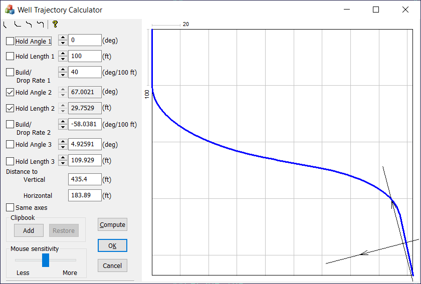

# Well Trajectory Calculator

An old exercise.

Any two parameters are calculated based on the remaining parameters, vertical and horizontal distance.



# PlaneTrajMath — Mathematical Model and Solver Description

## Overview

`PlaneTrajMath` implements a geometric trajectory solver in 2D space.

The code models a trajectory as a sequence of **three motion segments**, where each segment consists of:

- a **linear displacement** `L`
- a **curvature radius** `R`
- an **orientation angle** `Φ`

The solver reconstructs unknown trajectory parameters from two global constraints:

- **TVD** — total vertical displacement
- **Disp** — total horizontal displacement

The system solves various combinations of unknowns:

- lengths `L`
- radii `R`
- heading angles `Φ`

using:

- linear algebra
- trigonometric identities
- nonlinear equation reduction

---

# Coordinate Interpretation

Each trajectory cell contains:

| Variable | Meaning |
|---|---|
| `L` | Linear motion along direction `Φ` |
| `R` | Turning radius / curved contribution |
| `Φ` | Heading angle |

The trajectory consists of three consecutive elements:

```text
m_c[0], m_c[1], m_c[2]
```

---

# Fundamental Geometry

The trajectory accumulates displacement from:

1. straight motion
2. circular turning motion

The contribution of a straight segment is standard projection:

```math
x = L \sin(\Phi)
```

```math
y = L \cos(\Phi)
```

The curved contribution comes from integrating arc motion between two headings.

---

# Main Equations

The entire solver is built around two global equations.

---

## TVD Equation

```math
\mathrm{TVD}=L_0\cos\Phi_0+R_0(\sin\Phi_1-\sin\Phi_0)+L_1\cos\Phi_1+R_1(\sin\Phi_2-\sin\Phi_1)+L_2\cos\Phi_2+R_2(\sin\Phi_0-\sin\Phi_2)
```

Interpretation:

- linear segments contribute via `cos(Φ)`
- curved segments contribute via sine differences

---

## Disp Equation

```math
\mathrm{Disp}=L_0\sin\Phi_0+R_0(\cos\Phi_0-\cos\Phi_1)+L_1\sin\Phi_1+R_1(\cos\Phi_1-\cos\Phi_2)+L_2\sin\Phi_2+R_2(\cos\Phi_2-\cos\Phi_0)
```

Interpretation:

- linear segments project onto X using `sin(Φ)`
- arc segments contribute via cosine differences

---

# Why Sine/Cosine Differences Appear

For circular motion:

```math
dx = R(\cos\Phi_a-\cos\Phi_b)
```

```math
dy = R(\sin\Phi_b-\sin\Phi_a)
```

These expressions are exact integrals of motion along an arc.

That is why every curved component appears as a difference of trigonometric functions.

---

# Coordinate Transform Helpers

The functions:

- `Turn`
- `RotateUp`
- `RotateDown`

perform symmetry transformations of the trajectory.

These are used to:

- reduce duplicated solving logic
- reuse the same solver for multiple geometric cases
- normalize equations before solving

---

# Direct / Inverse Transform

## Direct()

Applies coordinate transformations and precomputes:

```cpp
sin0 = sin(Phi0)
cos0 = cos(Phi0)
```

etc.

This reduces repeated trigonometric evaluations.

---

## Inverse()

Restores the original coordinate ordering after solving.

---

# Error Functions

Two validation functions verify the reconstructed trajectory.

---

## TVD Error

```math
\epsilon_{TVD}=|TVD_{computed}-TVD_{target}|
```

---

## Disp Error

```math
\epsilon_{Disp}=|Disp_{computed}-Disp_{target}|
```

Solutions are accepted only if errors are sufficiently small.

---

# Linear Solver

## `FindSolution2x2`

Solves:

```math
\begin{cases}
Ax+By=C \\
Dx+Ey=F
\end{cases}
```

using determinant inversion.

---

## Determinant

```math
\Delta = BE - AE
```

If:

```math
|\Delta| < 10^{-10}
```

the system is treated as singular.

---

# Trigonometric Reduction

Several nonlinear systems are reduced to the canonical form:

```math
B=C\sin\Phi+D\cos\Phi
```

---

# Angle Recovery

Using the identity:

```math
C\sin\Phi+D\cos\Phi
=
\sqrt{C^2+D^2}\sin(\Phi+\alpha)
```

where:

```math
\alpha=\arctan\left(\frac{D}{C}\right)
```

the equation becomes:

```math
\sin(\Phi+\alpha)=\frac{B}{\sqrt{C^2+D^2}}
```

Thus:

```math
\Phi=\arcsin\left(\frac{B}{\sqrt{C^2+D^2}}\right)-\alpha
```

This is exactly what `FindAngle()` computes.

---

# `SimpleTrigonometric`

Solves systems of the form:

```math
\begin{cases}
Ax+B\sin\Phi+C\cos\Phi=D \\
Ex+F\sin\Phi+G\cos\Phi=H
\end{cases}
```

---

# `PuzzleTrigonometric`

Solves the coupled nonlinear system:

```math
\begin{cases}
A\cos\Phi-(x-B)\sin\Phi+Cx=D \\
A\sin\Phi+(x-B)\cos\Phi-Ex=F
\end{cases}
```

---

# Multi-Solution Ambiguity

Trigonometric systems naturally have multiple solutions:

```math
\sin(\theta)=\sin(\pi-\theta)
```

The code carefully evaluates:

- both candidate angles
- trajectory consistency
- displacement errors
- positivity constraints

before selecting a solution.

---

# `CalcPhiPhi`

This is the most sophisticated solver.

It solves simultaneously for:

- `Φ0`
- `Φ1`

---

# Relative Angle Reduction

The algorithm introduces:

```math
\Delta=\Phi_1-\Phi_0
```

This transforms the original coupled nonlinear system into a solvable form.

---

# Numerical Stability

The implementation contains several safeguards:

| Check | Purpose |
|---|---|
| `fabs(det) < 1e-10` | Singular matrix rejection |
| `fabs(arg) > 1` | Invalid `asin` domain |
| angle normalization | Keep angles in `[-π, π]` |
| residual checks | Reject unstable solutions |

---

# Solver Architecture

The class provides specialized solvers for different unknown combinations:

| Function | Solves For |
|---|---|
| `CalcLwhereR` | `L0`, `R0` |
| `CalcLltR` | `L0`, `R1` |
| `CalcLL` | `L0`, `L1` |
| `CalcRR` | `R0`, `R1` |
| `CalcLwherePhi` | `L0`, `Φ0` |
| `CalcLltPhi` | `L0`, `Φ1` |
| `CalcRwherePhi` | `R0`, `Φ0` |
| `CalcRgtPhi` | `R1`, `Φ0` |
| `CalcPhiPhi` | `Φ0`, `Φ1` |

---

# Summary

`PlaneTrajMath` is a compact analytical trajectory reconstruction engine based on:

- exact geometric equations
- symbolic trigonometric reduction
- determinant-based linear solving
- nonlinear angle recovery

The implementation avoids iterative optimization and instead derives closed-form or semi-closed-form analytical solutions wherever possible.
